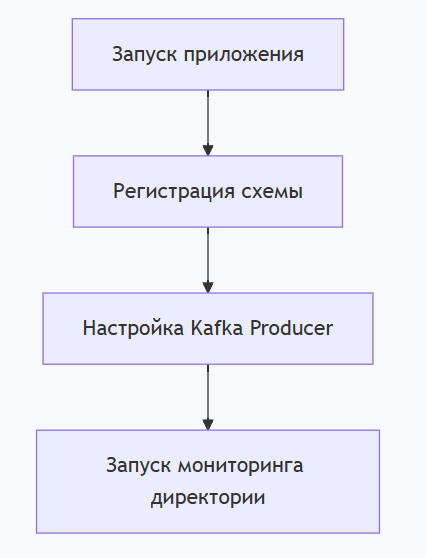
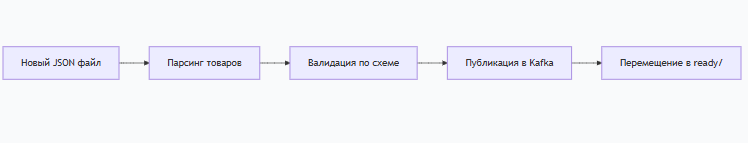
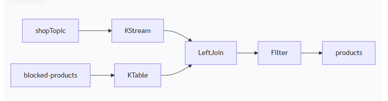
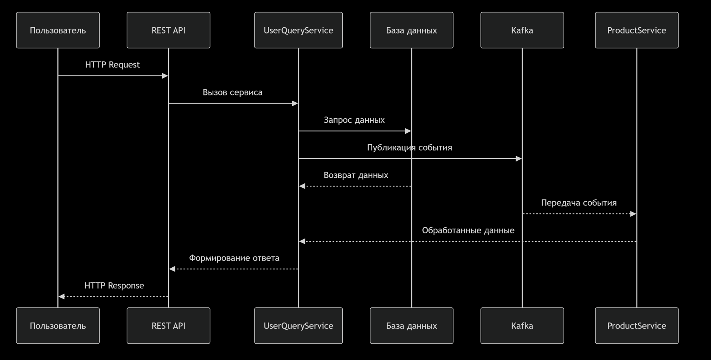

Kafka Cluster with Disaster Recovery
Этот проект разворачивает отказоустойчивый Apache Kafka кластер с поддержкой Disaster Recovery (DR) используя Docker Compose.

> Данный проект писался в учебных целях, для Yandex Prcticum в нем много недоработок, использовать только примеры, но не саму реализацию!
>> Работа всегда велась в вечернее время, после работы с 21 по 00, может содержать множество ошибок 
# Запуск 
```bash
docker-compose up -d
```
Ждем пока не запустятся все сервисы
Проверить, что все сервисы запущены

> Сервисы не падают полностью их требуется проверить и перезапустить при необхомости вручну
>  - shop-stoplist-producer
>  - client


# Тестирование
В корне в директории tests скрипты для посман, но они минимальные

## Основные технологии 

### Kafka
   - Apache Kafka
   - Kafka Connect
   - Kafka Streams
   - KSQL/ksqlDB

### Контейнеризация и оркестрация
   - Docker
   - Docker Compose

### Языки программирования
   - Java 17+
   - Spring Boot
   - SQL
   - bash

### Мониторинг
   - Prometheus
   - Grafana
   - Alertmanager
   - Kafka Exporter
   - JMX Exporter

### Базы данных и хранилища
   - PostgreSQL
   - Kafka Streams

### Безопасность
   - SSL/TLS
   - SASL/PLAIN
   - ACL
   - PKCS12/JKS

###  Веб-интерфейсы и API
   - Kafka UI
   - REST API
   - KSQL REST API


# Архитектура
Primary Cluster (Локальный)
Контроллер: kafka-controller-0 (nodeId: 4000)

Брокеры:

kafka-0 (nodeId: 1000) - порты 1090, 1091

kafka-1 (nodeId: 2000) - порты 2090, 2091

UI: Kafka UI на порту 8090

Schema Registry: на портах 8081, 8082

DR Cluster (Disaster Recovery)
Контроллер: kafka-controller-dr-0 (nodeId: 5000)

Брокеры:

kafka-dr-0 (nodeId: 3000) - порты 3090, 3091

kafka-dr-1 (nodeId: 3100) - порты 3190, 3191

UI: Kafka UI на порту 8091

Schema Registry: на портах 6081, 6082

Репликация
MirrorMaker2: Реплицирует данные между primary и DR кластерами
 
# Запуск кластера
Предварительные требования
Docker

Docker Compose

Генерация SSL сертификатов (см. раздел Security)

Запуск всех сервисов
```bash
docker-compose up -d
```
Запуск отдельных компонентов
```bash
# Только primary кластер
docker-compose up -d kafka-controller-0 kafka-0 kafka-1 kafka-ui

# Только DR кластер
docker-compose up -d kafka-controller-dr-0 kafka-dr-0 kafka-dr-1 kafka-ui-dr

# Schema Registry
docker-compose up -d schema-registry schema-registry-dr
```
# MirrorMaker
docker-compose up -d mirror-maker
🔧 Конфигурация
Security Configuration
Authentication: SASL/PLAIN

Encryption: SSL/TLS

Authorization: StandardAuthorizer с ACL

Super User: admin/admin или  admin/Qwerty111

Основные настройки Kafka
Primary Cluster
yaml
CLUSTER_ID: 'ciWo7IWazngRchmPES6q5A=='
KAFKA_PROCESS_ROLES: controller/broker
KAFKA_CONTROLLER_QUORUM_VOTERS: 4000@kafka-controller-0:4090
KAFKA_AUTO_CREATE_TOPICS_ENABLE: false
DR Cluster
yaml
CLUSTER_ID: 'drWo7IWazngRchmPES6q5B=='
KAFKA_PROCESS_ROLES: controller/broker
KAFKA_CONTROLLER_QUORUM_VOTERS: 5000@kafka-controller-dr-0:5090
KAFKA_AUTO_CREATE_TOPICS_ENABLE: true

## Сетевые порты
| Сервис             |	  Порт   |     Назначение     |
|--------------------|-----------|--------------------|
| kafka-0            | 1090      |	External listener |
| kafka-1            | 2090      |	External listener |
| kafka-dr-0         | 3090      |	External listener |
| kafka-dr-1         | 3190      |	External listener |
| kafka-ui           | 8090      |	Web Interface     |
| kafka-ui-dr        | 8091      |	Web Interface     |
| schema-registry    | 8081/8082 |	HTTP/HTTPS        |
| ksql-server        | 8088      | KSQL REST API     |
| schema-registry-dr | 6081/6082 |	HTTP/HTTPS        |
 

# Мониторинг
Kafka UI
Primary: http://localhost:8090

DR: http://localhost:8091

Доступ с credentials: admin/admin

Health Checks
```bash
# Проверка состояния брокеров
docker-compose ps

# Логи конкретного сервиса
docker-compose logs kafka-0
docker-compose logs schema-registry
```


## Сервисы мониторинга
Prometheus - сбор и хранение метрик
Порт: 9090
Конфигурация: .infra/prometheus/
Data: .infra/prometheus/prometheus_data/

Grafana - визуализация метрик
Порт: 3000
Учетные данные: admin/admin
Дашборды: .infra/grafana/dashboards/

Alertmanager - управление алертами
Порт: 9093
Конфигурация: .infra/alertmanager/
Kafka Exporter - сбор метрик Kafka
Порт: 9308

Подключение ко всем брокерам с SSL/SASL

```bash
# Полный стек мониторинга
docker-compose up -d prometheus alertmanager grafana kafka-exporter

# Только мониторинг
docker-compose up -d prometheus grafana kafka-exporter
```

## Проверка работы
Prometheus Targets: http://localhost:9090/targets
Grafana: http://localhost:3000 (admin/admin)
Alertmanager: http://localhost:9093
Kafka Exporter Metrics: http://localhost:9308/metrics

# Security
SSL Certificates
Требуется подготовить SSL сертификаты в директории ./cert/:

text
cert/
├── controller-creds/
│   ├── kafka.keystore.pkcs12
│   ├── kafka.truststore.jks
│   └── kafka_server_jaas.conf
└── kafka-0-creds/
├── kafka.keystore.pkcs12  
├── kafka.truststore.jks
└── kafka_server_jaas.conf
JAAS Configuration
Пример kafka_server_jaas.conf:

text
KafkaServer {
org.apache.kafka.common.security.plain.PlainLoginModule required
username="admin"
password="admin"
user_admin="admin"
user_producer="password"
user_consumer="password";
};

# MirrorMaker Configuration
MirrorMaker настраивается через конфигурационные файлы:

./infra/mirrormaker/consumer.cfg - конфигурация consumer для source кластера

./infra/mirrormaker/producer.cfg - конфигурация producer для target кластера

./infra/mirrormaker/start.sh - скрипт запуска

# KSQL
KSQL - для прокидывания рекомендаций. Настройки:

./infra/ksql/init.sql

# Управление топиками
Инициализация топиков
```bash
docker-compose up kafka-init
```
Ручное создание топиков
```bash

# Подключение к брокеру
docker exec -it kafka-0 kafka-topics \
--bootstrap-server kafka-0:1090 \
--command-config /etc/kafka/secrets/client.properties \
--create --topic test-topic \
--partitions 3 --replication-factor 2
```
# Утилиты
Подключение через kafka-console-producer
```bash
docker exec -it kafka-0 kafka-console-producer \
--bootstrap-server kafka-0:1090 \
--topic test-topic \
--producer.config /etc/kafka/secrets/client.properties
```
Подключение через kafka-console-consumer
```bash
docker exec -it kafka-0 kafka-console-consumer \
--bootstrap-server kafka-0:1090 \
--topic test-topic \
--from-beginning \
--consumer.config /etc/kafka/secrets/client.properties
```
# Остановка и очистка
Остановка всех сервисов
```bash
docker-compose down
```
Остановка с удалением volumes
```bash
docker-compose down -v
```
Перезапуск конкретного сервиса
```bash
docker-compose restart kafka-0
```


# Модули

## shopProducer

ShopProducerApplication - это Java-приложение для пакетной обработки JSON-файлов с товарами и их публикации в Apache Kafka топик. Приложение автоматически регистрирует схему данных в Schema Registry и обрабатывает файлы из указанной директории.

## Архитектура
Основные компоненты:
Kafka Producer - отправка сообщений в Kafka

Schema Registry Client - регистрация и валидация схем данных

File Watcher - мониторинг директории на наличие новых файлов

JSON Parser - парсинг товаров из JSON файлов

## Структура директорий
text
/etc/
├── data/          # Входная директория для новых JSON файлов
├── ready/         # Директория для обработанных файлов  
└── schema/
└── product.json  # JSON схема для валидации товаров

## Конфигурация
Параметры приложения:
```java
private static final String INPUT_DIR = "/etc/data";
private static final String PROCESSED_DIR = "/etc/ready";
private static final String SCHEMA_PATH = "/etc/schema/product.json";
private static final long POLL_INTERVAL_MS = 5000L;
private static final long MESSAGE_DELAY_MS = 1000L;
```

Параметры Kafka (через KafkaProperties):
KafkaProperties.getProducerProperties() - настройки продюсера

KafkaProperties.getSchemaRegistryUrl() - URL Schema Registry

KafkaProperties.getShopProducerTopicName() - название топика

## Рабочий процесс
1. Инициализация




2. Обработка файлов




## Методы
main(String[] args)
Назначение: Точка входа приложения

Поток: Инициализация продюсера → регистрация схемы → запуск обработки файлов

registerSchema()
Назначение: Регистрация JSON схемы в Schema Registry

Использует: CachedSchemaRegistryClient

Схема: Читается из файла /etc/schema/product.json

loadSchemaFromFile()
Назначение: Загрузка схемы из файловой системы

Возвращает: JSON схему как строку

getFileProducts(String path)
Назначение: Парсинг списка товаров из JSON файла

Использует: Jackson ObjectMapper

Возвращает: List<Product> или null при ошибке

publishingProducts(Producer<String, Product> producer)
Назначение: Основной цикл обработки файлов

Логика:

Поиск JSON файлов в входной директории

Парсинг товаров из файла

Последовательная публикация каждого товара в Kafka

Перемещение обработанного файла

Пауза между проверками новых файлов

## Логирование
Приложение использует SLF4J для логирования ключевых событий:

✅Будет создано {}: - количество товаров для публикации

Публикуем в {}: {} - успешная публикация сообщения

Ошибка при публикации сообщения - ошибки при отправке в Kafka

Не удалось получить из файла: {} - проблемы с чтением файла


🚀 Запуск
Требования:
Apache Kafka кластер с включенным Schema Registry

SSL сертификаты (если используется SSL)

SASL аутентификация (если настроена)

Команда запуска:
```bash
docker-compose ud -d shopproducer
```

## Обработка ошибок
Ошибки парсинга JSON: Файл пропускается, ошибка логируется

Ошибки подключения к Kafka: Retry логика через Kafka Producer

Ошибки Schema Registry: Приложение останавливается с исключением

Проблемы с файловой системой: Логируются, продолжается работа
 
## Производительность
Задержка между сообщениями: 1000 мс

Интервал проверки файлов: 5000 мс

Размер пула Schema Registry: 10 соединений

Обработка в одном потоке

## Безопасность
Приложение использует те же настройки безопасности, что и основной Kafka кластер:

SASL/PLAIN аутентификация

SSL/TLS шифрование

Настройки через KafkaProperties

## Управление состоянием
Статус файлов: Отслеживается через перемещение между директориями

Схемы: Кэшируются Schema Registry клиентом

Подключения: Управляются через try-with-resources

Эта документация покрывает все аспекты работы Shop Producer Application для интеграции с вашим Kafka кластером.


# Shop Product Filter Stream

ShopProductFilterStreamApplication - это Kafka Streams приложение для фильтрации товаров в реальном времени. Приложение использует KTable для хранения заблокированных товаров и фильтрует входящий поток сообщений, отсеивая запрещенные продукты.

## Архитектура
Топология потоков:





## Компоненты:
KStream - поток входящих товаров из топика shopTopic

KTable - таблица заблокированных товаров из топика blocked-products

Left Join - объединение потока с таблицей заблокированных товаров

Filter - фильтрация заблокированных товаров

## Конфигурация
Основные параметры:
```java
private static final ObjectMapper mapper = new ObjectMapper();
private static final AtomicLong blockedProductsCounter = new AtomicLong(0);
```

Топики:
Входной топик: shopTopic - поток товаров для фильтрации

Топик заблокированных товаров: blocked-products - KTable с запрещенными продуктами

Выходной топик: products - отфильтрованные разрешенные товары

### Рабочий процесс
1. Инициализация KTable
   ```java
   KTable<String, String> blockedProductsTable = builder.table(
   KafkaProperties.getTopicBlockedProducts(),
   Consumed.with(Serdes.String(), Serdes.String()),
   Materialized.as("blocked-products-store")
   );
   ```
2. Мониторинг изменений KTable
   Логирование добавления/удаления заблокированных товаров

Подсчет общего количества заблокированных продуктов

Отслеживание изменений в реальном времени

3. Обработка основного потока товаров
   Этапы обработки:
   Парсинг входящих сообщений

Валидация и очистка данных

Left Join с KTable заблокированных товаров

Фильтрация по статусу блокировки

Отправка разрешенных товаров в выходной топик

## Ключевые методы
startStreamsProcessing()
Назначение: Основной метод настройки и запуска потоковой обработки

Функции:

Создание StreamsBuilder

Настройка KTable и KStream

Определение топологии обработки

Запуск и мониторинг Kafka Streams

extractProductNameFromJson(JsonNode product)
Назначение: Извлечение имени продукта из JSON

Поля поиска: name, productName, product, title, itemName

Возвращает: Имя продукта или null

cleanInput(String input)
Назначение: Очистка и валидация входных данных

Функции:

Удаление контрольных символов

Проверка структуры JSON

Обработка Avro magic bytes

startMetricsLogger(KafkaStreams streams)
Назначение: Периодический вывод метрик приложения

Интервал: 30 секунд

Метрики: Количество заблокированных товаров, метрики Kafka Streams

## Логирование и мониторинг
Ключевые события:
Обработка товаров:
>>> NEW PRODUCT ARRIVED <<< - получен новый товар

🔍 JOINING PRODUCT WITH BLOCKED LIST - проверка блокировки

🎉 PRODUCT ALLOWED - товар разрешен

🚷 PRODUCT BLOCKED - товар заблокирован

KTable изменений:
➕ BLOCKED PRODUCT ADDED/UPDATED - добавлен заблокированный товар

🗑️ BLOCKED PRODUCT REMOVED - удален из блокировки

📊 CURRENT BLOCKED PRODUCTS COUNT - текущее количество

Системные события:
🔄 KAFKA STREAMS STATE CHANGE - изменение состояния приложения

📈 METRICS - периодические метрики

🛑 Shutting down streams application - graceful shutdown

## Класс ProcessingResult
Назначение:
Хранение результатов обработки для передачи между операциями Streams.

Поля:
productValue - исходное значение товара

allowed - флаг разрешения

reason - причина решения

## Особенности реализации
State Management:
KTable Materialization: blocked-products-store

Atomic Counter: blockedProductsCounter для быстрого доступа к количеству

Error Handling:
Uncaught Exception Handler: Ловит необработанные исключения

Graceful Shutdown: 30-секундный таймаут для закрытия

Data Validation: Проверка и очистка входных данных

Performance:
Left Join: Эффективное объединение потока с таблицей

Filter Early: Ранняя фильтрация невалидных данных

Incremental Updates: KTable автоматически обновляется

## Запуск и управление
Запуск:
```bash
docker-compose ud -d shop-product-filter-stream
```

## client

Модуль client представляет собой Spring Boot приложение, которое обрабатывает пользовательские поисковые запросы, сохраняет их в базу данных, публикует в Kafka и предоставляет персонализированные рекомендации.

## Архитектура



## Компоненты

Kafka Producer - публикация запросов в топик userQuery
Kafka Consumer - потребление рекомендаций из топика user_recommendations
JPA Repository - сохранение запросов в PostgreSQL
KSQL Processing - потоковая обработка и генерация рекомендаций
REST Controller - API для поиска и получения рекомендаций

## Топики

Входной топик: userQuery - поток пользовательских поисковых запросов
Топик рекомендаций: user_recommendations - сгенерированные рекомендации
Выходной API: REST endpoints для клиентов

## Рабочий процесс

1. Обработка поискового запроса
2. Сохранение и публикация запроса
   - Создание объекта UserQuery
   - Сохранение в PostgreSQL через UserQueryRepository
   - Преобразование в DTO и сериализация в JSON
   - Публикация в Kafka топик userQuery
   - Логирование результата операции
3. KSQL обработка
4. Потребление рекомендаций
   - Подписка на топик user_recommendations
   - Десериализация JSON в UserRecommendation
   - Сохранение в in-memory кэш (ConcurrentHashMap)
   - Предоставление API для получения рекомендаций

## Логирование и мониторинг

### Ключевые события:

Обработка запросов:

✅ Start work saveAndPublishUserQuery - начало обработки

✅ User query saved to DB - успешное сохранение

✅ User query published to Kafka - успешная публикация

Kafka сообщения:

📥 Received recommendation for user - получена рекомендация

✅ Processed recommendation for user - рекомендация обработана

Ошибки:

❌ Failed to publish user query - ошибка публикации

❌ Failed to parse recommendation - ошибка парсинга


## Особенности реализации

### State Management:

   - In-Memory Cache: ConcurrentHashMap для хранения рекомендаций
   - Database Persistence: PostgreSQL для долговременного хранения запросов
   - Kafka Offsets: Автоматическое управление смещениями

### Error Handling:

   - Transaction Management: @Transactional для операций БД
   - Kafka Retries: Повторные попытки отправки сообщений
   - Graceful Degradation: Работа при недоступности рекомендаций

### Performance:

   - Async Processing: Асинхронная отправка в Kafka
   - Connection Pooling: Оптимизация подключений к БД
   - Batch Processing: KSQL агрегация запросов

### Security: 

   - SASL/SSL: Защищенное подключение к Kafka
   - Input Validation: Проверка пользовательского ввода
   - SQL Injection Protection: JPA параметризованные запросы

## REST API

   - GET - /products?userId=5&query=Кожаный - Поиск товаров + сохранение запроса
   - GET - /users/{userId}/recommendations - Получение персонализированных рекомендаций
   - GET - /debug/recommendations - Отладочная информация о кэше

## Запуск и управление
Запуск:
```bash
docker-compose ud -d client
```